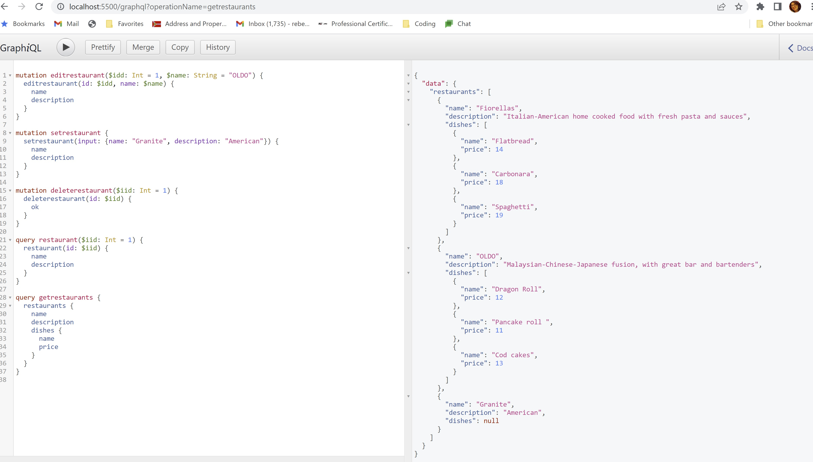

# Restaurant-Data
Week 24 GraphQL assignment using GraphiQL and mutations

#### Installation:
Once all the files are on your computer, you can run node index.js and you should be able to go to:
http://localhost:5500/graphql

#### Usage:
 
You will be able to add, edit, delete, and list a single or all the restaurants. Here's a sample of what you can run on the GraphIQL interface:
mutation editrestaurant($idd: Int = 1, $name: String = "OLDO") {
  editrestaurant(id: $idd, name: $name) {
    name
    description
  }
}

mutation setrestaurant {
  setrestaurant(input: {name: "Granite", description: "American"}) {
    name
    description
  }
}

mutation deleterestaurant($iid: Int = 1) {
  deleterestaurant(id: $iid) {
    ok
  }
}

query restaurant($iid: Int = 1) {
  restaurant(id: $iid) {
    name
    description
  }
}

query getrestaurants {
  restaurants {
    name
    description
    dishes {
      name
      price
    }
  }
}
 
#### Support: 
 
I would just check the website version if you can't get a cloned version to work.
 
#### Roadmap: 
I'd like the website to adjust to the screen size.
 
#### License information:
 
MIT license
